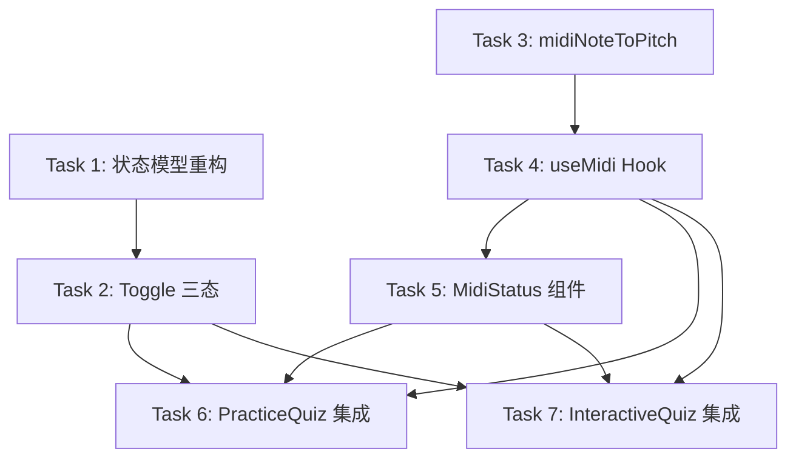

# Implementation Plan

## Overview

为视奏练习应用的单音识别模块添加 MIDI 输入模式。将现有布尔型输入模式重构为三值枚举 `InputMode`，新增 `useMidi` Hook 封装 Web MIDI API 生命周期，实现 `midiNoteToPitch` 转换函数，并在 PracticeQuiz 和 InteractiveQuiz 页面集成 MIDI 答题模式。

## Tasks

- [ ] 1. 重构输入模式状态模型 [requirement: 1] [depends on: none]
  - [ ] 1.1 在 `src/hooks/useNotesInputMode.ts` 中定义并导出 `InputMode = 'options' | 'piano' | 'midi'` 类型
  - [ ] 1.2 重构 `useNotesInputMode` hook 返回 `[InputMode, (mode: InputMode) => void]`
  - [ ] 1.3 从 localStorage 读取时兼容旧值 `'piano'` 和 `'options'`，无效值默认 `'options'`
  - [ ] 1.4 在 `src/pages/client/StageSelector.tsx` 中更新 `NOTES_INPUT_MODE_KEY` 的使用方式
  - [ ] 1.5 从 NotesInputModeToggle 中移除 localStorage 写入逻辑（改由 hook 内部处理）

- [ ] 2. 改造 NotesInputModeToggle 为三态 [requirement: 2] [depends on: 1]
  - [ ] 2.1 修改 Props 类型为 `{ mode: InputMode; onChange: (mode: InputMode) => void; accentColor?: string }`
  - [ ] 2.2 渲染三个按钮 '选项'、'键盘'、'MIDI'
  - [ ] 2.3 检测 `navigator.requestMIDIAccess` 可用性，不支持时 MIDI 按钮 disabled 并显示 tooltip
  - [ ] 2.4 高亮当前选中的按钮
  - [ ] 2.5 更新所有使用该组件的页面（StageSelector、PracticeQuiz、InteractiveQuiz）的 prop 传递

- [ ] 3. 实现 midiNoteToPitch 工具函数 [requirement: 4] [depends on: none]
  - [ ] 3.1 在 `src/core/engine/pitchUtils.ts` 中新增 `midiNoteToPitch(midiNumber: number): string` 函数
  - [ ] 3.2 实现标准 MIDI 编号到 Pitch String 的映射（升号优先，60 → 'C4'）
  - [ ] 3.3 导出该函数供 useMidi hook 使用

- [ ] 4. 实现 useMidi Hook [requirement: 3, 4, 6] [depends on: 3]
  - [ ] 4.1 新建 `src/hooks/useMidi.ts`
  - [ ] 4.2 实现 `UseMidiOptions` 接口（`enabled: boolean`, `onNoteOn: (pitch: string) => void`）
  - [ ] 4.3 实现 `UseMidiReturn` 接口（`status`, `deviceName`, `error`）
  - [ ] 4.4 当 `enabled` 为 true 时调用 `navigator.requestMIDIAccess()` 并处理权限
  - [ ] 4.5 枚举输入端口，选取第一个已连接的 MIDIInput
  - [ ] 4.6 监听 `midimessage` 事件，解析 NoteOn（0x90 + velocity > 0）并调用 `midiNoteToPitch` + `onNoteOn`
  - [ ] 4.7 监听 `onstatechange` 响应热插拔
  - [ ] 4.8 `enabled` 变为 false 时执行清理（移除监听、释放引用）
  - [ ] 4.9 处理错误状态：`unsupported`、`permission-denied`、`no-device`、`disconnected`

- [ ] 5. 实现 MidiStatus 组件 [requirement: 5, 6] [depends on: 4]
  - [ ] 5.1 新建 `src/components/MidiStatus.tsx`
  - [ ] 5.2 根据 `status` 渲染不同状态信息（connecting / connected / no-device / permission-denied / disconnected / unsupported）
  - [ ] 5.3 connected 状态显示设备名称
  - [ ] 5.4 样式适配答题区域位置，不遮挡五线谱

- [ ] 6. PracticeQuiz 页面集成 MIDI 模式 [requirement: 5] [depends on: 2, 4, 5]
  - [ ] 6.1 在 PracticeQuiz 中将 `usePiano` 替换为 `mode`（来自重构后的 `useNotesInputMode`）
  - [ ] 6.2 调用 `useMidi` hook，`enabled` 设为 `mode === 'midi'`，`onNoteOn` 绑定 `handleAnswer`
  - [ ] 6.3 将渲染逻辑改为三分支：piano / options / midi（MidiStatus 组件）
  - [ ] 6.4 确保 MIDI 模式下的物理键盘监听不冲突（options 模式的 keydown 监听已按模式隔离）

- [ ] 7. InteractiveQuiz 页面集成 MIDI 模式 [requirement: 5] [depends on: 2, 4, 5]
  - [ ] 7.1 在 InteractiveQuiz 中将 `usePiano` 替换为 `mode`
  - [ ] 7.2 调用 `useMidi` hook，仅在 `module === 'notes'` 且 `mode === 'midi'` 时启用
  - [ ] 7.3 将音符答题渲染逻辑改为三分支
  - [ ] 7.4 确保与现有 keyboard shortcut 逻辑兼容

## Task Dependency Graph

```json
{
  "waves": [
    {
      "wave": 1,
      "tasks": [1, 3],
      "description": "独立基础工作：状态模型重构和 midiNoteToPitch 工具函数"
    },
    {
      "wave": 2,
      "tasks": [2, 4],
      "description": "依赖 wave 1 的中间层：Toggle 三态改造和 useMidi Hook"
    },
    {
      "wave": 3,
      "tasks": [5],
      "description": "MidiStatus 组件，依赖 useMidi Hook"
    },
    {
      "wave": 4,
      "tasks": [6, 7],
      "description": "页面集成：PracticeQuiz 和 InteractiveQuiz"
    }
  ]
}
```



## Notes

- MIDI 功能为纯增量功能，不修改现有选项模式和钢琴模式的任何行为
- 不支持 Web MIDI API 的浏览器（如 Firefox）中，MIDI 按钮自动 disabled，不影响现有功能
- localStorage 向后兼容：已存储 `'piano'` 的用户无需迁移
- MIDI 输入经 `midiNoteToPitch` 转换后复用相同的 `handleAnswer` → `pitchEqual` 答题路径
